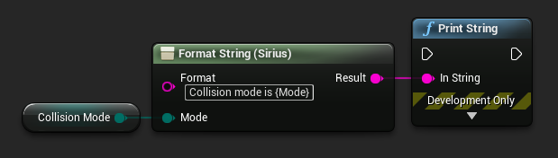
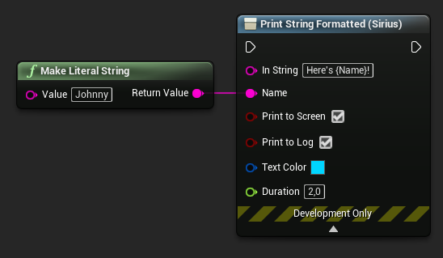

# Sirius Utility Nodes for Unreal Engine

A collection of utility nodes to boost your blueprint productivity with Unreal Engine projects.

Marketplace (coming soon) • [Suggestions / Issues](https://github.com/JasperDeLaat94/sirius-utility-nodes/issues) • [Contact](https://twitter.com/jasper_de_laat)

## Features

- Easy setup - Simply install and enable, no configuration required.
- Format String - The power of Format Text for non-localized strings.
- Print String Formatted - Print debug strings with built-in formatting of parameters.

### Format String

The **Format String** node is a string-based equivalent to Unreal's built-in **Format Text** node.
It is intended to be used in cases where the flexibility of Format Text is desired without the burden of having to use FText, such as for debug logging.
Advantages include:

- The same powerful "`{}`" argument syntax.
- **No casting** from Text to String.
- `Format` string is not localized, so you **won't forget** to turn it off.
- Supports **Enum** arguments without having to cast to String.
- Supports **Integer64** arguments.

### Print String

**Print String Formatted** offers a convenient experience for printing debug strings with values.
It is essentially a **Format String** and **Print String** node in one.
Simply use the same "`{}`" syntax to add argument pins.

## Installation

### Unreal Marketplace (UE4.25+)

1. Use the **"Free"** button to obtain the plugin.
2. Install the plugin using the **Epic Games Launcher**:
   1. Go to the **Unreal Engine** tab.
   2. Open the **Library** tab and scroll down to the **Vault** section.
   3. Find the plugin and click **"Install to Engine"** (restart the launcher if it hasn't appeared yet).
3. After installation, open your project and enable the plugin:
   1. **Edit > Plugins**
   2. **Installed > Sirius**
   3. Check the **"Enabled"** checkbox of the **Sirius Utility Nodes** plugin.
   4. Restart the editor.

### Source

1. Create a **"Plugins"** folder in your project.
2. Clone this repo in your Plugins folder.
3. Enable the plugin found under **Project > Sirius**.

## Contributing

I appreciate all contributions. Examples of how you can help:

- If you have a bug or idea, please open an 'issue' in the [issues tab](https://github.com/JasperDeLaat94/sirius-utility-nodes/issues).
- If you want to contribute to the code, feel free to fork the project and create a pull request.
  - Feel free to contact me via [Twitter](https://twitter.com/jasper_de_laat) or open an issue if you want to discuss things first.

## License

The source code of this plugin is licensed under the standard [MIT License](https://github.com/JasperDeLaat94/sirius-utility-nodes/blob/main/LICENSE).
